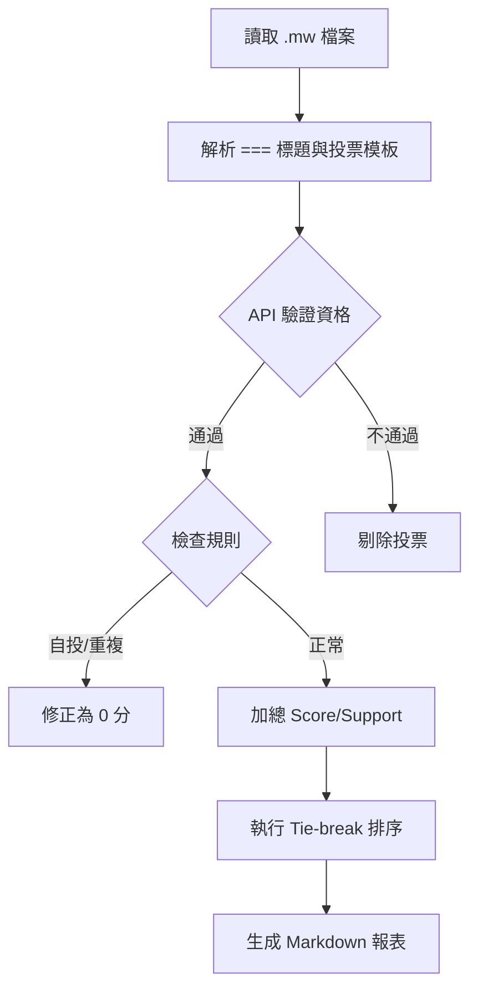

# Wikimedia Commons Photo Challenge Tally Tool

這是一個專為維基共享資源（Wikimedia Commons）每月照片挑戰設計的自動化計票工具，旨在精確解析 MediaWiki 語法並根據社群規則計算得分與排名。

## 1. 統計邏輯與規則

### 評分機制
* **得分 (Score)：** $3*/2*/1*$ 票數之加權總和（權重分別為 3, 2, 1 分）。
* **支持度 (Support)：** $3*/2*/1*$ 票數與 $0*$ 高度推薦票的總計數。
* **排名判定：** 優先比較 **Score**，若分數相同則以 **Support** 進行 Tie-break。

### 投票資格過濾
1.  **基本門檻：** 註冊滿 10 天且編輯數超過 50 次，或該次挑戰的參賽者。
2.  **誠實原則：** 禁止投給自己的作品。
3.  **格式修正：** 同一投票者若對多張照片投下重複的 1/2/3 名等級，除第一筆外皆自動轉換為 0 分（高度推薦）。

## 2. 推薦程式架構

### 技術棧 (Suggested Tech Stack)
* **Language:** Python 3.10+
* **MediaWiki Parser:** `mwparserfromhell`
* **API Client:** `Pywikibot` 或原生 `requests`
* **Data Analysis:** `Pandas`

### 程式流程圖 (Mermaid)

## 3. API 整合參考
本工具需串接 Wikimedia Commons API  進行動態驗證：
* 用戶資格： action=query&list=users&usprop=editcount|registration
* 參賽者確認： action=query&prop=revisions&titles=File:NAME.jpg